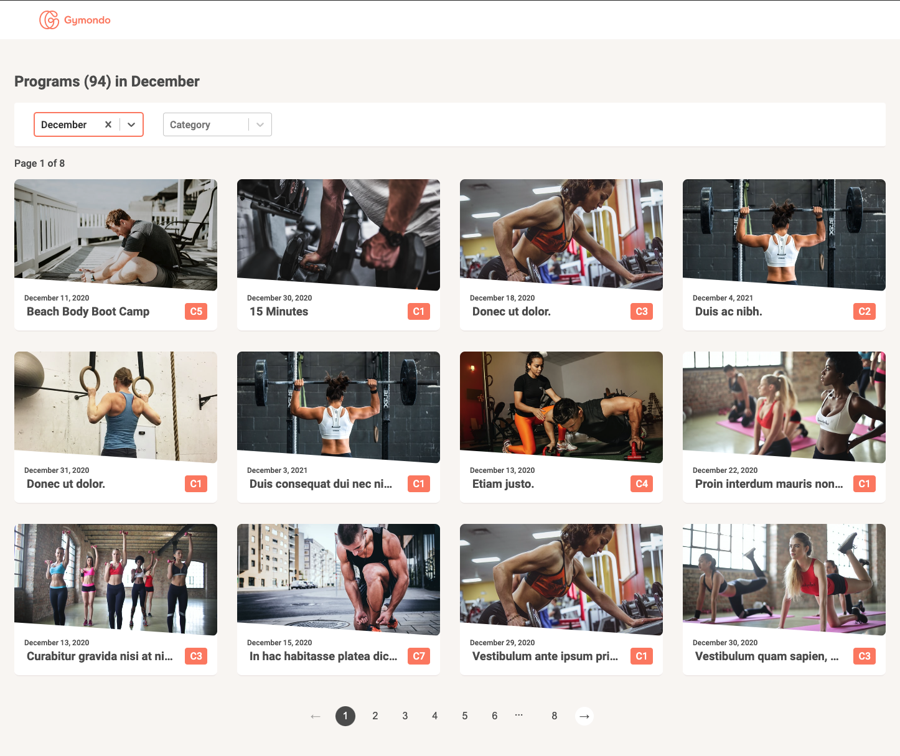

# Craig Neeson Gymondo Tech Test

## Prerequisites

There are only two required tools to run up the repo.

- [`yarn`](https://yarnpkg.com/)
- [`node@v12.18.3`](https://nodejs.org/en/)

## Run it up

- `yarn install` - will install dependencies for the `ui` and `server` sub-directories.
- `yarn start` - will start the `ui` and `server` simultaneously.
- Navigate to [`http://localhost:3000/`](`http://localhost:3000/`) to view the UI.
- Access the API endpoints on [`http://localhost:9000/`](`http://localhost:9000/`).

## Tech Stack
- UI
    - View Library | [React](https://reactjs.org/)
    - Language | [TypeScript](https://www.typescriptlang.org/)
    - Styles | [Styled-components](https://styled-components.com/) & [Styled-system](https://styled-system.com/)
    - API Interactions | [React-query](https://github.com/tannerlinsley/react-query)
- API
    - Language | [JavaScript](https://www.javascript.com/)
    - Web Server | [Express](https://expressjs.com/)
    - Database | [SQLLite](https://www.sqlite.org/index.html)

## Priorities

My main priority over the week was to hit all of the functional acceptance criteria listed in the task document. A few of my side-goals were:

- **All screens are responsive** - I wanted to ensure that the solution is usable and looks good for all screen sizes.
- **Centralised theme** - Consistent design-tokens are something that I value in a UI repo. Many of the styles used in the repo are centralised in a theme module.
- **Few domain-specific components** - Most of the UI is built from reusable components that have genericism in mind.
- **Robust Query Support** - Due to the emphasis on large dataset performance in the task specification, I wanted to make sure that the solution had response caching and retry support. The use of [react-query](https://github.com/tannerlinsley/react-query) allowed both of these targets to be hit with little effort.

## Limitations

 Below I hope to provide some background around limitations of the solution and how they might have been addressed with a longer timescale.

- **No tests.**  There are no unit or end-to-end tests included in this solution. If more time is provided, I would be happy to demonstrate some of my testing skills. The technologies I use to implement tests are [Jest](https://jestjs.io/), [Cypress](https://www.cypress.io/) and [react-testing-library](https://testing-library.com/docs/react-testing-library/intro/).
- **Accessibility.** I have semantically structured the HTML in this solution to provide easy tab-indexing for keyboard only interactions. However there is no support for screen-readers included.
- **Third-party Select** - Again due to focusing on the functional requirements of the task, I opted for [react-select](https://react-select.com/home) to provide the multi-select dropdown functionality. Typically I will write all components from scratch, but vendoring in a pre-built component felt like the better play here.
- **More Robust API Code** - I would have liked to spend a bit more time defining a better structure for how data is accessed in the API layer. Currently the codebase has an API and Service layer, ideally I'd have liked to add a Repository layer to provide a better separation of concerns.
- **Workout Categories** - The values for Workout Categories are currently stored clientside in a constant. Ideally I would have had the categories stored in the database in their own table with a foreign key link between `workouts` and `workout_categories`.

## Deviations from task guidelines
- The task guidelines ask for a datepicker filter. I changed this to a simple month dropdown since the smallest useful unit that a user can filter the results by is month, not date. This simplifies things from a querying standpoint, but more importantly it feels like a better use-experience.

## Data Sources

A few sources were used to gather mock data for the project.

- **Gymondo Public Endpoint** - A small subset of high-fidelity workout data was gathered from the `https://www.gymondo.com/api/v1/public/programs` endpoint.
- **[Mockaroo](https://www.mockaroo.com/)** - Mockaroo was used to provide the other ~950 rows that the database required, this data is generated and so is mostly gibberish.
- **[Unsplash](https://unsplash.com/s/photos/workout)** - Royalty-free workout images were sourced from Unsplash.

